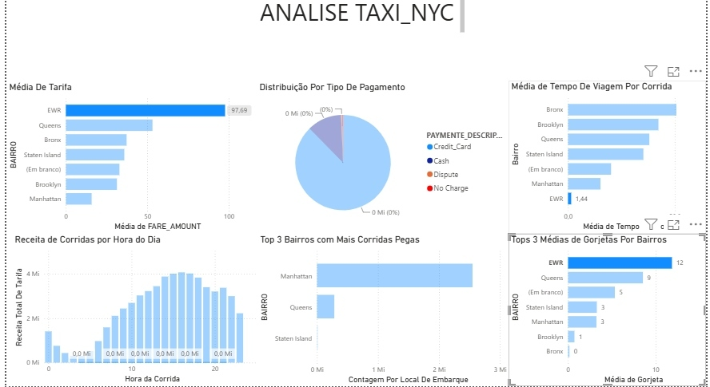

# NYC Yellow Taxi — Pipeline de Dados no Snowflake

Pipeline de dados completo para o dataset **NYC TLC Yellow Taxi Trip Records**, construído no Snowflake utilizando a **Arquitetura Medallion** (Bronze → Silver → Gold) com modelagem **Star Schema** na camada Gold, e exposto em um dashboard de BI conectado diretamente à camada de consumo.

## Visão Geral

Este projeto implementa um pipeline de engenharia de dados end-to-end sobre corridas de táxi amarelo de Nova York, publicadas pela NYC Taxi & Limousine Commission (TLC). O objetivo é transformar dados brutos de milhões de corridas em informações estruturadas e confiáveis — receita por período, tempo médio de viagem, distribuição geográfica de embarques e padrões de pagamento — através de uma arquitetura em camadas dentro do Snowflake.

A solução organiza o dado em três estágios (Bronze, Silver, Gold), garantindo rastreabilidade ao dado de origem, qualidade controlada em cada transformação e uma camada final modelada como Star Schema, pronta para consumo analítico via BI.

## Arquitetura

```
[Fonte NYC TLC]
      │
      ▼
┌──────────────────────────────────┐
│  BRONZE  NYC_TAXI_RAW            │
│  TAXI_BRONZE   (3,8M linhas)     │
│  TAXI_ZONE_D   (263 zonas)       │
│  Tudo VARCHAR — bruto como recebido │
└──────────────┬───────────────────┘
               │  02_load_bronze_to_silver.sql
               ▼
┌──────────────────────────────────┐
│  SILVER  TAXI_SILVER             │
│  TAXI_PRATA   (3,8M linhas)      │
│  Tipado, limpo, filtrado por qualidade │
└──────────────┬───────────────────┘
               │  06 a 10_load_*.sql
               ▼
┌──────────────────────────────────┐
│  GOLD  TAXI_OURO  (Star Schema)  │
│  FACT_TRIP + DIM_DATE            │
│  DIM_LOCATION  DIM_PAYMENT  DIM_VENDOR │
│  Camada analítica / BI           │
└──────────────────────────────────┘
```

## Conjunto de Dados

O dataset utilizado é o **NYC TLC Yellow Taxi Trip Records**, dataset público sem informações sensíveis (PII). Os principais campos tratados no pipeline:

| Campo | Descrição |
|---|---|
| `TPEP_PICKUP_DATETIME` / `TPEP_DROPOFF_DATETIME` | Data e hora de embarque e desembarque |
| `PULOCATIONID` / `DOLOCATIONID` | IDs de zona de embarque e desembarque (TLC, 1–265) |
| `PASSENGER_COUNT` | Número de passageiros autodeclarado |
| `TRIP_DISTANCE` | Distância percorrida (milhas) |
| `FARE_AMOUNT` / `TIP_AMOUNT` / `TOTAL_AMOUNT` | Tarifa base, gorjeta e valor total cobrado |
| `PAYMENT_TYPE` | Tipo de pagamento (1=Cartão, 2=Dinheiro, 3=Sem cobrança, 4=Disputa) |
| `VENDORID` | Identificador do fornecedor do sistema de despacho |

Na camada Bronze, todas as colunas são carregadas como `VARCHAR` para evitar falhas de carga por variações de formato ou valores inesperados. Na transformação para Silver, os registros com tarifas negativas, zero passageiros, distâncias inválidas e timestamps invertidos (pickup ≥ dropoff) são filtrados, e os tipos são convertidos com funções `TRY_TO_*` — conversões que falham retornam `NULL` em vez de abortar a carga.

## Stack Tecnológica

- **Snowflake** — data warehouse em nuvem, hospedando as três camadas de dados
- **SQL** — todas as transformações, modelagem dimensional e criação de views de consumo
- **Arquitetura Medallion** — Bronze / Silver / Gold
- **Star Schema** — modelagem dimensional na camada Gold
- **BI (Power BI)** — camada de visualização, conectada diretamente às tabelas Gold no Snowflake
- **Dataset** — NYC TLC Yellow Taxi Trip Records (público)

## Pipeline de ETL

O pipeline segue três etapas principais, cada uma correspondendo a uma camada em `sql/`:

### Extract & Load (Bronze)
Os arquivos brutos da TLC (Parquet/CSV) são carregados via `COPY INTO` diretamente na tabela `TAXI_NYC.NYC_TAXI_RAW.TAXI_BRONZE`, com todas as colunas em `VARCHAR`, preservando o schema original sem qualquer modificação. A tabela de zonas (`TAXI_ZONE_D`) é carregada da mesma forma, mapeando as 263 zonas oficiais da TLC.

### Transform (Silver)
O script `02_load_bronze_to_silver.sql` aplica tipagem via `TRY_TO_*`, filtros de qualidade (tarifas negativas, zero passageiros, timestamps invertidos) e grava o resultado limpo em `TAXI_NYC.TAXI_SILVER.TAXI_PRATA`.

### Modelagem (Gold)
Os scripts em `sql/03_gold/` criam e populam a tabela de fatos `FACT_TRIP` e as dimensões `DIM_DATE`, `DIM_LOCATION`, `DIM_PAYMENT` e `DIM_VENDOR`, formando o Star Schema da camada `TAXI_OURO`, pronta para consumo analítico.

## Modelagem — Star Schema (Camada Gold)

A camada Gold segue o modelo **Star Schema**: uma tabela fato central conectada a tabelas dimensão, otimizando queries analíticas por reduzir JOINs e permitir agregações eficientes.

```
              DIM_DATE
                 │
DIM_LOCATION ─ FACT_TRIP ─ DIM_PAYMENT
  (pickup)        │
              DIM_LOCATION      DIM_VENDOR
              (dropoff)
```

| Tabela | Tipo | Descrição |
|---|---|---|
| `FACT_TRIP` | Fato | Uma linha por corrida — métricas (tarifa, gorjeta, distância) e chaves estrangeiras |
| `DIM_DATE` | Dimensão | Atributos temporais (ano, mês, dia, dia da semana, hora) |
| `DIM_LOCATION` | Dimensão | Zonas de embarque e desembarque (263 zonas TLC, usada duas vezes na fato) |
| `DIM_PAYMENT` | Dimensão | Tipo de pagamento (cartão, dinheiro, disputa, sem cobrança) |
| `DIM_VENDOR` | Dimensão | Fornecedor do sistema de despacho da corrida |

Chave primária de `FACT_TRIP`: `TRIP_ID` (surrogate key, `IDENTITY`). Relacionamentos via `DATE_ID`, `PICKUP_LOCATION_ID`, `DROPOFF_LOCATION_ID`, `PAYMENT_ID` e `VENDOR_ID_SURROGATE`.

## Dashboard

O dashboard de BI conecta-se diretamente às tabelas da camada Gold (`TAXI_OURO`) no Snowflake, expondo os resultados da modelagem dimensional em painéis analíticos. Cada visual é alimentado por uma query sobre `FACT_TRIP` com os respectivos joins nas dimensões `DIM_LOCATION`, `DIM_DATE` e `DIM_PAYMENT`, o que garante que qualquer atualização no pipeline reflita automaticamente nas métricas exibidas.

Os painéis cobrem as principais dimensões de análise do negócio: a **Média de Tarifa por Bairro** revela que corridas originadas em EWR (Aeroporto de Newark) possuem ticket médio (97,69) muito acima do restante da cidade, evidenciando o impacto da origem geográfica no valor da corrida. A **Distribuição por Tipo de Pagamento** demonstra a dominância quase absoluta do cartão de crédito sobre dinheiro, disputa e sem cobrança, enquanto a **Receita de Corridas por Hora do Dia** expõe o padrão de concentração de faturamento entre o início da tarde e o início da noite.

Complementarmente, os gráficos de **Top 3 Bairros com Mais Corridas Pegas** e **Média de Tempo de Viagem por Bairro** confirmam Manhattan como epicentro de volume de embarques, ao passo que o Bronx apresenta os maiores tempos médios de deslocamento — informação derivada diretamente da dimensão `DIM_LOCATION` combinada às métricas de tempo em `FACT_TRIP`. O painel de **Top 3 Médias de Gorjeta por Bairro** encerra a análise com um indicador de comportamento do passageiro por região, onde EWR lidera novamente, com média de gorjeta de 12 — reforçando o mesmo padrão observado na tarifa.



## Estrutura do Repositório

```
sql/
├── 00_setup/
│   └── 01_create_database_and_schemas.sql
├── 01_bronze/
│   ├── 01_create_taxi_bronze.sql
│   ├── 02_create_taxi_zone_lookup.sql
│   └── load_from_stage.sql
├── 02_silver/
│   ├── 01_create_taxi_silver.sql
│   └── 02_load_bronze_to_silver.sql
└── 03_gold/
    ├── 01_create_dim_data.sql
    ├── 02_create_dim_location.sql
    ├── 03_create_dim_payment.sql
    ├── 04_create_dim_vendor.sql
    ├── 05_create_fact_trip.sql
    ├── 06_load_dim_data.sql
    ├── 07_load_dim_location.sql
    ├── 08_load_dim_payment.sql
    ├── 09_load_dim_vendor.sql
    ├── 10_load_fact_trip.sql
    ├── 11_patch_dropoff_date_id.sql
    └── analytical_queries.sql
docs/
├── architecture.md
├── data_dictionary.md
└── dashboard.png
```

## Decisões de Design

| Decisão | Motivo |
|---|---|
| Todas as colunas Bronze são VARCHAR | Evita falhas de carga por variações de formato ou NULLs inesperados |
| Funções `TRY_TO_*` na Silver | Conversões falhas retornam NULL — sem cargas abortadas |
| Filtros de qualidade no INSERT da Silver | Rejeita tarifas negativas, zero passageiros e timestamps invertidos |
| `NULLIF` no cálculo de % de gorjeta | Protege contra divisão por zero em corridas com tarifa zero |
| Star Schema na Gold | Separa métricas (fato) de contexto (dimensão) — queries analíticas mais simples e performáticas |
| `DIM_LOCATION` reutilizada para pickup e dropoff | Evita duplicação de dimensão — mesma tabela de zonas referenciada duas vezes na fato |

## Como Executar

### Pré-requisitos

- Conta ativa no Snowflake (Free Trial funciona)
- Cliente `snowsql` configurado ou acesso via Snowsight
- Arquivos Parquet/CSV do NYC TLC Trip Record Data disponíveis em stage

### Execução

```sql
-- 1. Configuração de database e schemas
snowsql -f sql/00_setup/01_create_database_and_schemas.sql

-- 2. Camada Bronze — criação e carga bruta
snowsql -f sql/01_bronze/01_create_taxi_bronze.sql
snowsql -f sql/01_bronze/02_create_taxi_zone_lookup.sql
snowsql -f sql/01_bronze/load_from_stage.sql

-- 3. Camada Silver — tipagem e qualidade
snowsql -f sql/02_silver/01_create_taxi_silver.sql
snowsql -f sql/02_silver/02_load_bronze_to_silver.sql

-- 4. Camada Gold — Star Schema (dimensões + fato)
snowsql -f sql/03_gold/01_create_dim_data.sql
snowsql -f sql/03_gold/02_create_dim_location.sql
snowsql -f sql/03_gold/03_create_dim_payment.sql
snowsql -f sql/03_gold/04_create_dim_vendor.sql
snowsql -f sql/03_gold/05_create_fact_trip.sql
snowsql -f sql/03_gold/06_load_dim_data.sql
snowsql -f sql/03_gold/07_load_dim_location.sql
snowsql -f sql/03_gold/08_load_dim_payment.sql
snowsql -f sql/03_gold/09_load_dim_vendor.sql
snowsql -f sql/03_gold/10_load_fact_trip.sql
snowsql -f sql/03_gold/11_patch_dropoff_date_id.sql

-- 5. Executar queries analíticas / conectar o BI
snowsql -f sql/03_gold/analytical_queries.sql
```

> Detalhes de arquitetura e schemas em [`docs/architecture.md`](docs/architecture.md) e [`docs/data_dictionary.md`](docs/data_dictionary.md).

## Aprendizados

Este projeto consolidou na prática os conceitos de arquitetura Medallion, modelagem dimensional (Star Schema) e boas práticas de qualidade de dados no Snowflake — como o uso de `TRY_TO_*` para conversões seguras e filtros de qualidade explícitos antes de promover dados entre camadas.

## Fonte dos Dados

[NYC TLC Trip Record Data](https://www.nyc.gov/site/tlc/about/tlc-trip-record-data.page) — dataset público, sem informações sensíveis.
